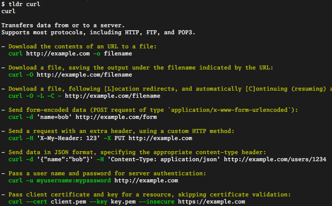

<div align="center"></div>
<p align="center">
<a href="https://github.com/leighmcculloch/tldr/actions"></a>
<a href="https://goreportcard.com/report/github.com/leighmcculloch/tldr"></a>
</p>

A single binary CLI containing the [tldr-pages](https://github.com/tldr-pages/tldr) collection of simplified and community-driven man pages.

## What



## Why

To fulfill use cases not fulfilled by existing [tldr clients](https://github.com/tldr-pages/tldr#clients). Existing tldr clients either:
* Make http requests to download tldr-pages as required. This is not ideal when developing without an internet connection.
* Require package managers or development environments to be installed. 

## Install

### Binary (Linux binary, deb, rpm, pacman; macOS; Windows)

Download and install the binary from the [releases](https://github.com/leighmcculloch/tldr/releases) page.

### Source

```
go get 4d63.com/tldr
```
